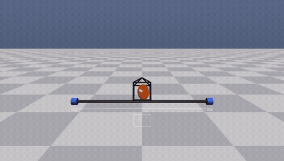
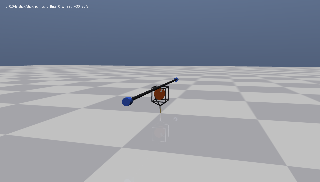
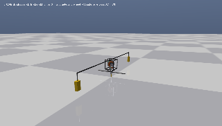
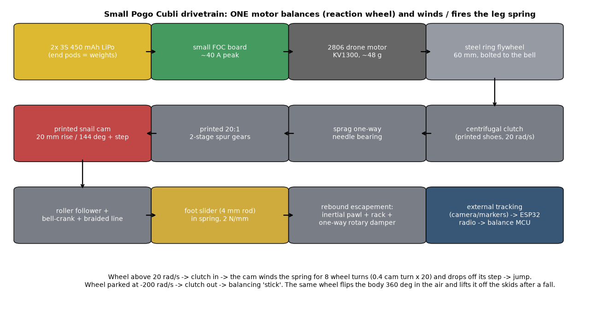

# One-Wheel Cubli in MuJoCo

A simulation replica of

> M. Hofer, M. Muehlebach, R. D'Andrea, **"The One-Wheel Cubli: A 3D inverted pendulum that can balance with a single reaction wheel"**, *Mechatronics* 91 (2023) 102965. [doi:10.1016/j.mechatronics.2023.102965](https://doi.org/10.1016/j.mechatronics.2023.102965) (open access, CC BY 4.0)

It is built in [MuJoCo](https://mujoco.org), with the paper's full estimation and control stack and a tuned controller.


*Tuned controller: it recovers from a 3°/−2° initial tilt, a 1.5 N drop on one end mass (t = 3 s), a 6 N sideways push on the housing (t = 7 s) and a drop on the other end mass (t = 11 s). The full-resolution MP4 is [media/cubli_tuned.mp4](media/cubli_tuned.mp4).*

## What the paper does

The system balances on one corner. It has two tilt degrees of freedom (roll α, pitch β) and only **one** reaction wheel, mounted at 45° between the two tilt axes. It is controllable only because a 1.25 m cantilever with two 0.3 kg end masses makes the pitch inertia much larger than the roll inertia. The resulting time-scale separation (natural-frequency ratio ≈ 1/(1+√2), the inverse *silver ratio*) lets a single torque steer both angles. The controller is a delay-compensating steady-state Kalman filter plus an LQR on a 14-state model that includes the cantilever bending modes.

## What is replicated here

| Paper | This repo |
|---|---|
| 4-body model, generalised coords (α, β, γ, φ, δ₁, δ₂), App. A | `cubli/model.py`. MJCF generated from the Table A.1 parameters. The housing gets three stacked hinges x→y→z, which is exactly the paper's Euler chain. The cantilevers are hinges about body-z at Q, with the identified torsional stiffness k and damping d. |
| Linearised, reduced model, Eq. (11) | `cubli/linearize.py`. Finite-difference linearisation of the MuJoCo model, then the same reduction (drop φ, γ). |
| 5-IMU accelerometer tilt estimate, Eq. (8) | `cubli/controller.py:imu_weights`. MuJoCo accelerometer/gyro sites: 4 in a square near the pivot and 1 far away. |
| Complementary filter, 0.98 / 0.02 (Sec. 5.2) | `Controller.tilt` |
| 1-step-delay-augmented steady-state KF, Eqs. (18)–(21) | `Controller.step` |
| Discrete LQR at Ts = 10 ms, Eqs. (22)–(23); KF tuning, Eq. (24) | `cubli/controller.py:design` |
| CoM-offset estimation by low-pass filtering α, β (Sec. 6) | `Controller.step` |
| Simulation with torque limits, I²t overheat protection, delay, noise (Sec. 7.1) | `cubli/sim.py` |
| Fig. 5 (disturbance rejection), Fig. 6 (beam-frequency sensitivity) | `scripts/make_figures.py` |

### Check 1: the linear model matches Eq. (11)

The MuJoCo model is built only from Table A.1, and its linearisation reproduces the paper's A and B matrices to the printed precision (asserted in `tests/test_replication.py`):

| entry | paper | MuJoCo |
|---|---|---|
| ∂α̈/∂α | 57.7 | 57.7 |
| ∂α̈/∂β | 0.1 | 0.1 |
| ∂β̈/∂β | 10.6 | 10.6 |
| ∂φ̈/∂α, ∂φ̈/∂β | −40.9, −7.5 | −40.8, −7.5 |
| ∂δ̈₁/∂α, ∂δ̈₁/∂δ̇₁, ∂δ̈₁/∂δ̇₂ | −4.2, −19.8, −12.6 | −4.2, −19.8, −12.5 |
| ∂α̈/∂δ̇ᵢ, ∂φ̈/∂δ̇ᵢ | ±4.6, ∓3.2 | ±4.6, ∓3.2 |
| B (α̈, β̈, φ̈, δ̈₁, δ̈₂) | −20.7, −2.3, 1122, 7.4, −7.4 | −20.7, −2.3, 1122.0, 7.4, −7.4 |
| ε = π_β/π_α | 0.43 | 0.428 |

The only mismatch is the β̈ ← δ coupling: the paper prints 75.8, MuJoCo gives 83.3. The paper does not print the other large beam entries (∗).

### Check 2: it balances with the paper's design

With the paper's structure and weights (Eqs. 23–24), the simulated system balances indefinitely. This holds with sensor noise, sensor bias, a 10 ms measurement delay, the torque envelope, I²t derating, and a deliberately injected 2 mm CoM offset. The disturbance response has the same qualitative signature as the paper's Fig. 5. A push in +β first makes the controller command a *negative* torque, which drives α up quickly (the fast axis). A positive torque then brings both angles back together along the level lines of the control law.


The paper says its Fig. 5 disturbance was "approximately the maximum disturbance from which the system can recover". The same holds here. The recoverable drop on an end mass is small (~2 N for 50 ms), because correcting β takes α excursions about 9× larger (B: −20.7 vs −2.3). Those excursions push the wheel toward its no-load speed.

### Where this simulation disagrees with the paper

**Cantilever sensitivity (Fig. 6) is not reproduced.** The paper reports that a ±1 Hz error in the assumed cantilever frequency causes visible structural oscillations. It also reports that ignoring the flexibility altogether destabilises the loop. In this simulation, with the paper's k and d, neither happens:

- The torque and α spectra are almost identical for controllers that assume 56.2, 57.2 or 58.2 Hz.
- A controller designed on a rigid-beam model (k → 10⁸) also balances.


The mechanisms behind the real-hardware effect are not modelled. Plausible candidates are the motor current-loop dynamics, torque ripple, IMU mounting on the flexible structure, anti-aliasing filters, and the 57 Hz mode sitting above the 50 Hz Nyquist frequency. The beam model and the controller's beam states are still fully implemented, so any of those effects can be added.

## Tuning

`scripts/tune.py` runs CMA-ES (40 generations × 40 candidates, warm-started from a shorter first pass) over 20 log-scale multipliers on the paper's weights:

- the 9 LQR state weights plus a shared weight on the delayed states;
- the process- and measurement-noise groups of the KF;
- the complementary-filter weight;
- the CoM-estimator time constant.

The objective (`cubli/evaluate.py:cost`) combines:

- tilt jitter, RMS torque (heating) and mean wheel speed while balancing for 60 s;
- the largest recoverable drop on an end mass and push on the housing (bisection);
- survival and jitter under model errors: beam at 56.2 / 58.2 Hz, end masses +10 %, roll inertia +10 %, a 2-step delay, and 3× sensor noise.

The result is stored in `cubli/tuned_params.json`.

| metric (sim, 3 noise seeds) | paper weights | tuned | change |
|---|---|---|---|
| max recoverable drop on end mass (N, 50 ms) | 2.10 | **2.38** | +13 % |
| max recoverable push on housing top (N, 50 ms) | 8.73 | **10.49** | +20 % |
| tilt jitter α / β (std, deg) | 0.092 / 0.041 | **0.067 / 0.038** | −27 % / −7 % |
| RMS motor torque while balancing (N m) | 0.083 | **0.044** | −47 % |
| mean wheel speed after 30–60 s (rad/s) | 12.1 | **≈0** | |
| survives all 6 model-error scenarios | ✓ | ✓ | |
| torque RMS with 3× sensor noise (N m) | 0.247 | **0.129** | −48 % |

What changed (see `cubli/tuned_params.json` and `cubli/tunings.py`):

- **LQR weights were redistributed, but the net gains barely moved.** The α weight fell 50× and the β weight 2×. The wheel-speed weight rose 2.4× and the weight on the delayed states rose about 140×. The resulting gains are close to the paper's (α: −133 → −146, β: 268 → 294 N m/rad).
- **The Kalman filter trusts the gyro rates much more.** Rate measurement noise went down about 240× and rate process noise up about 20×. This removes estimator lag on α̇ and β̇ and cuts the noise reaching the motor.
- **Much faster CoM-offset estimator** (τ = 20 s → 0.8 s). It acts as an integrator on the balance point, so the wheel speed now averages to zero within seconds. That keeps full torque headroom available for the next disturbance. Ablation: the paper weights with only τ = 0.83 s already reach a 2.27 N drop / 9.4 N push, about half of the total gain. The tuned weights with the old τ = 20 s fall back to 1.73 N / 8.2 N.
- **Complementary filter leans harder on the gyro** (accelerometer weight 0.02 → 0.002).

One trade-off shows in the disturbance plot. The tuned controller uses less peak torque and about half the I²t heating, but it undershoots more on the way back (β reaches about −3.6° instead of −2.2°).

## Assumptions (not given in the paper)

These are flagged with `ASSUMED` in `cubli/params.py`, `cubli/sim.py` and `cubli/controller.py`:

- **Motor envelope.** No-load speed 450 rad/s, stall torque 8 N m, and an I²t budget of about 1 s at peak torque. The paper gives only the 3.4 N m peak and 0.5 N m continuous figures. The no-load speed matters most: it sets the maximum recoverable disturbance.
- **Sensor noise.** MPU-6050-class accelerometer noise 0.04 m/s², gyro noise 0.004 rad/s, residual biases, and Hall-sensor speed noise 0.3 rad/s.
- **IMU positions.** Only the layout (4 near the pivot + 1 far away) is from the paper.
- **State normalisation used before applying Q and R.** The paper normalises but does not give the scales. The printed LQR gain (Eq. 25) is therefore not directly comparable, although its sign pattern (−, −, +, +, +, −, −, +, +) matches.
- **Model additions.** A 2 mm CoM offset toward the motor, and friction at the pivot about the vertical axis: 4·10⁻³ N m dry plus a small viscous term, which is roughly a hard corner on a table.

### Why yaw is not controlled (and can't be, with this wheel)

Like the paper, the controller only stabilises roll and pitch. Yaw is not just left out: the fixed wheel cannot stop a yaw spin at all. About the pivot, gravity and the ground force exert no torque around the vertical, and the motor torque is internal. The total vertical angular momentum is therefore conserved. When the system is balanced, the wheel axis is horizontal, so all of that momentum sits in the body's yaw rotation. In the simulation, a 0.2 rad/s spin is still exactly 0.200 rad/s after 10 s of active balancing.

Gyroscopic coupling does appear once the wheel spins: the yaw ↔ α̇/β̇ terms grow linearly with wheel speed. It can only shuffle momentum around while the body wobbles. Only an external torque stops the spin, which here is the pivot friction. The alternative is a second actuator that can give stored momentum a vertical component: a vertical-axis reaction wheel (as in the original three-wheel Cubli) or a gimbaled wheel (control moment gyroscope). Both of those also saturate and eventually need friction to unload.
- **Wheel inertia.** The paper's wheel inertia includes the motor rotor, so I_wx > I_wy + I_wz, which is not a valid single rigid body. The transverse wheel inertia is raised just enough to be physical. That is a change of about 4·10⁻⁵ kg m² against a housing inertia of about 3·10⁻² kg m², and Check 1 is unaffected.

## Usage

```bash
python -m venv .venv && . .venv/bin/activate
pip install -r requirements.txt

pytest -q                                       # replication checks
python -c "from cubli.sim import run; r = run(T=10); print('fell:', r.fell)"
MUJOCO_GL=egl python scripts/make_figures.py    # figures + results/benchmark.json
MUJOCO_GL=egl python scripts/make_video.py tuned  # or: paper
python scripts/tune.py 40 cubli/tuned_params.json # re-run the CMA-ES tuning (uses 40 cores)
```

Interactive viewer:

```bash
python -c "import mujoco.viewer; from cubli.model import load; m, d = load(); mujoco.viewer.launch(m, d)"
```

### What if the flywheel is offset? (`scripts/wheel_offset.py`)

**Tilting the wheel axis out of the horizontal plane by ζ** gives the motor torque a vertical component, and yaw becomes controllable. Vertical angular momentum is still conserved (L_z = I_z·γ̇ + I_w·sin ζ·ω), so a yaw spin can only be moved *into the wheel*: stopping 0.2 rad/s needs ω ≈ 0.05 / (I_w sin ζ).

One LQR over roll, pitch and yaw at once collapses the balance gains and falls. A cascade works: the paper's balance loop stays as is, and a slow outer loop steers yaw by moving the wheel-speed setpoint (rate-limited, ±300 rad/s). Results with sensor noise and delay, no pivot friction:

| tilt ζ | stop a 0.2 rad/s spin | 30° heading error | max recoverable drop |
|---|---|---|---|
| 0° (paper) | impossible | impossible | 2.37 N |
| 5° | only halves it (needs 628 rad/s of wheel speed) | → 1.9° | 2.77 N |
| 10° | → 0.012 rad/s (wheel 283 rad/s, 315 predicted) | → 1.1° | 2.62 N |
| 15° | falls | → 1.1° | 2.02 N |
| 20° | falls | → 1.0° | 0.82 N |
| 25° | falls | → 0.9° | cannot balance |

So about 10° of tilt buys yaw control without losing balance margin. Beyond about 15°, the roll/pitch authority lost to cos ζ and the gyroscopic coupling at high wheel speed make it fragile. With realistic pivot friction the benefit shrinks. Friction stops spins by itself, but it also destroys the momentum the wheel would need to hand back, so large heading changes run the wheel to its limit.

**An off-centre wheel mass (unbalance)** does nothing useful: the rotating force averages to zero over each turn. It is also nearly harmless here, because the wheel idles near 0 rad/s while balancing. Even 4 mm of offset (0.9 g·m) only lowers the recoverable drop from 2.37 N to 2.06 N, since it only bites during recoveries when the wheel spins at hundreds of rad/s.

Both are adjustable in the live viewer (Plant: wheel tilt, unbalance, pivot friction; plus a yaw-control panel). The viewer's yaw loop is more conservative than the script. Its priorities are balance > stop the spin > heading. It caps the wheel target at 250 rad/s and fades heading correction out as the wheel nears that budget, because the balance loop tracks the wheel-speed target loosely (overshoots of about 150 rad/s) and a looser loop ran the wheel into saturation after about 50 s. At 10° tilt and no friction, it absorbs about 80 % of a 1.5 N sideways tap's spin and never falls in 150 s tests. This frictionless loop has since been replaced in the viewer by the friction-aware controller described next.

### Yaw control on a realistic, frictional pivot (`cubli/yaw.py`, `scripts/yaw_friction.py`)

The frictionless yaw loop above doesn't carry over to a real pivot. With a tilted wheel, three extra things are needed:

1. **Proper wheel-speed tracking.** The balance LQR regulates around a moving wheel-speed reference, plus a feedforward lean and torque that make the wheel accelerate as commanded (`Controller.step(..., wheel_ref=(w_ref, a_ff))`). Two things broke along the way. Removing the LQR's own wheel-speed feedback destabilises balance: its 0.03 N m per rad/s gain looks small but is worth several N m in transients. Feedforward alone lets the wheel drift, because the balance point is never known exactly.
2. **A friction-aware yaw controller** that works in three modes:
   - **turn:** PD on heading on the slow, whole-body timescale (the end masses sit on flexible beams, so a fast jerk only turns the housing: 8× the gain). It adds Coulomb-friction compensation and a breakaway kick.
   - **unload:** each second of turning burns τ_s / (I_w sin ζ) ≈ 25 rad/s of wheel speed at 10°. So once the wheel has used its 150 rad/s turning budget, the controller stops pushing and lets friction stop the body. It then spins the wheel down gently enough (30 % of the stiction torque) that the body stays put and the momentum goes into the ground. Big turns ratchet: turn, unload, turn.
   - **hold:** on target, stiction holds the heading for free, and the gyro bias is re-estimated while the body is known to be still.
3. **A realistic budget.** The balance loop tracks the wheel target loosely (about 150 rad/s of overshoot), so turning stops well short of the 450 rad/s limit. A 220 rad/s budget made 15° tilt fall; 150 rad/s works.

Results on the realistic plant: pivot dry friction 4·10⁻³ N m, 2 mm CoM offset, sensor noise and bias, 10 ms delay.

| tilt | 45° heading command | back to 0° (after 60 s) | 1.5 N sideways tap | 3-min hold drift | max drop |
|---|---|---|---|---|---|
| 10° | ratchets, 14.5° reached after 35 s | 4.8° off | peaks 24.6°, returns to 3.8°, wheel unloaded to 1 rad/s | −1.0° | 2.72 N |
| 15° | 32° reached after 35 s | 3.5° off | peaks 18.5°, returns to 3.6°, wheel 1 rad/s | −0.15° | 2.86 N |

Robustness: no falls in 24 runs with pivot friction at 0.5×, 1× and 2× the controller's assumption, at 10° and 15° tilt, over two noise seeds. The peak wheel speed stayed at or below 304 rad/s. The remaining heading error of about 3–10° is a sensing limit: heading is the integrated gyro, and errors picked up while turning (including slow creep during unloading) stay. An absolute heading sensor (magnetometer, camera) would remove it. Turns are slow, and slower still with more friction. That's the price of pushing a 1.25 m bar around against a sticky pivot with 0.08–0.12 of the wheel's torque.

### What if the two end masses become a ring? (`scripts/ring_design.py`)

The idea: replace the cantilever and end masses with a hoop in the pitch plane, so it looks like a ring balancing with the flywheel inside. I kept the paper's parameters as far as physically possible. The hoop is modelled as rigid, and the carbon tube's mass is removed from the housing.

**It can't keep the parameters, for a geometric reason.** The paper's added mass is wide and low: end masses 0.6 m out and only 0.21 m up. That makes pitch inertia about 5× roll inertia (ε = 0.43, the silver ratio). A circle standing on its bottom is as tall as it is wide:

- a uniform hoop adds MR² about pitch but 1.5·MR² about roll (both about its bottom point), capping the ratio at 4/3;
- even with all its mass at 3 and 9 o'clock the cap is 2.

| | bar (paper) | A: hoop, housing in middle | B: hoop through pivot | C: Ø0.4 m hoop through pivot + 2×0.3 kg at 3/9 o'clock |
|---|---|---|---|---|
| what's kept | – | total mass, pitch inertia | pitch inertia, gravity torque | – |
| size | 1.25 m bar | R 0.32 m, 0.74 kg | R 0.84 m, 0.18 kg | R 0.2 m, 0.1 kg hoop + weights |
| ε = π_β/π_α | 0.43 | 0.91 | 0.87 | 0.78 |
| controllability volume (Eq. 4) | 0.39 | 0.0004 | 0.0011 | 0.038 |
| balances | yes | **no**: needs gains around 5,500 N m/rad, saturates the motor within 0.2 s even with perfect sensors | **no** | yes, but fragile |
| recoverable initial tilt | > 2° | – | – | about 1° |
| max drop on the far end (50 ms) | 2.34 N | – | – | 0.63 N |
| wheel speed while undisturbed | ~0 | – | – | 190–230 rad/s |

With nearly equal tilt frequencies, the single wheel can barely tell the two directions apart. The LQR gains explode and the 3.4 N m / 450 rad/s motor saturates. Getting a ring-like shape to work well needs the mass wide and low again:

- a flattened (elliptical) hoop;
- a hoop balanced on a post at its centre, so the ring's height no longer counts;
- or a much stronger actuator.

All three layouts can be picked in the live viewer (Plant → Layout).

**Bigger motor for hoop A?** (`scripts/ring_bigmotor.py`) I scaled the motor ×2–10 (torque, and its mass: +0.36 kg per ×1) and the flywheel ×1–8 (inertia and mass), re-searching 81 LQR weightings per size. **Nothing balanced.** Taking the problem apart:

| actuator | sensors | result |
|---|---|---|
| unlimited torque and speed, no added mass | perfect | recovers from ≤ 0.3° (needs 30 N m peaks and 9° swings). From 1°, it swings to 24° and falls even with 99 N m |
| unlimited, no added mass | MPU-6050 class (as the paper) | falls (2/3 seeds; 3/3 with the 2 mm CoM offset) |
| unlimited, no added mass | 10–100× better | balances |
| real ×10 motor + ×10 flywheel (+5.5 kg at the hoop centre) | 10–100× better | falls: the added central mass pushes ε even closer to 1 |
| massless 7–34 N m motor with 2000 rad/s no-load speed | 10× better | balances on some seeds only, wheel at 760–1000 rad/s |

The hoop's tilt frequencies are nearly equal (ε = 0.91), so correcting a small error in the weakly controllable direction takes seconds of large, coordinated swings (25–65× the error). That makes the hoop hypersensitive to sensor error, and a heavier actuator at the centre makes ε worse. A bigger motor is not the fix. The fix is restoring the inertia asymmetry (flattened hoop, or a hoop on a post).

**Hoop plus a balancing pole that always stays level?** (`scripts/ring_pole.py`) This is hoop A with the paper's tube and end masses mounted at the hoop centre. It uses the most generous controller setting: perfect state feedback, the 10 ms delay compensated, and the paper's motor limits.

| pole | unstable rates (rad/s) | recovers from | max drop on hoop edge |
|---|---|---|---|
| none | 4.97 / 4.54 | 0.1° | – |
| rigid (rotates with the body, like the paper) | 5.08 / 3.75 | 0.5° | 2.2 N |
| level on a free gimbal | 5.08 / 4.74 | not controllable (the pole's angles are decoupled) | – |
| level, hanging 5 cm below its gimbal | 5.15 / 4.74 | 0.1° | – |
| level, held by its own gimbal motor (2 actuators) | 5.08 / 4.74 | 1° | ≥ 8 N |

A pole only helps if the body has to rotate it; that is where its inertia comes from. If it stays level, the body never swings it. Its rotational inertia is decoupled, and it acts exactly like a point mass at the mount: the unstable rates match to 0.05 %. That adds roll and pitch inertia equally, making things worse. The only level-pole version that works uses a second motor to hold the pole level. That motor then pushes on the body, so the system is no longer single-actuator.

**Elliptical hoop (single motor, housing in the middle).** (`scripts/ring_ellipse.py`) Every shape keeps the paper's total mass and pitch inertia about the pivot. The pivot tip sits low enough that the rim clears the ground up to 15° of tilt. It runs on the full realistic stack: noise and bias, delay, CoM offset, and the paper's motor.

| hoop | size (w × h) | ε | balances | max end drop | max side push | recovers from |
|---|---|---|---|---|---|---|
| uniform, circle → b/a = 0.12 | 0.64 × 0.64 → 1.65 × 0.20 m | 0.91 → 0.63 | **no** (none of 7 shapes) | – | – | – |
| b/a 0.5, 90 % of the mass in 3/9 o'clock weights | 0.94 × 0.47 m | 0.68 | no | – | – | – |
| **b/a 0.35, 90 % in tip weights** | 1.04 × 0.36 m | 0.59 | yes | 1.9 N | 4.8 N | 1° |
| **b/a 0.25, 90 % in tip weights** | 1.10 × 0.28 m | 0.52 | yes | 2.2 N | 6.7 N | 1° |
| b/a 0.18, 90 % in tip weights | 1.14 × 0.20 m | 0.48 | yes | 2.3 N | 8.3 N | 2° |
| paper bar | 1.25 m | 0.43 | yes | 2.3 N | 10.5 N | 2° |

A uniform hoop never gets there. Its mass is spread along the curve and counts only about ⅓ toward pitch inertia, compared with the same mass at the tips. So the hoop has to be both flattened *and* have most of its mass at 3 and 9 o'clock. The roundest single-motor ring that balances is about 1.04 × 0.36 m. A search over LQR weights changed nothing here, so the limit is physical, not tuning. The three balancing ovals are presets in the live viewer (Plant → Layout). There, the drop buttons hit the hoop's tip weights.

### A ring that can actually roll (`cubli/rolling.py`, `cubli/rolling_kane.py`, `scripts/rolling_hoop.py`)

This is a circular hoop (Ø0.66 m) rolling on the floor with real MuJoCo rim–floor contact, balanced sideways by the single reaction wheel. A hoop resting on a fixed pivot tip can't roll, and a housing bolted into a rolling hoop tumbles with it, losing lean authority every quarter turn. So the design uses a **hub**: the hoop turns freely on an axle bearing, and the housing and flywheel hang from the axle like a pendulum, staying upright however far the hoop rolls.

What the physics allows, and what it took:

- **Speed control needs a second motor.** With only the reaction wheel, the hoop spins on a free bearing and its rolling momentum is conserved. Connecting the housing rigidly doesn't help either: a reaction wheel can change rolling speed by only about ±0.45 m/s before it saturates, and it would tumble with the hoop. The final design adds a **hub motor** between the hoop and the hanging housing. It swings the housing forward or back, gravity holds it there, and that drives the hoop, the way pendulum-drive robots work (see "Speed control" below).
- **Speed changes everything.** Uncontrolled it falls sideways below ~1.25 m/s and is self-stable above, like a rolling coin. A controller designed at standstill fails at speed, because gyroscopic coupling turns lean torque into turning. The controller is a **speed-scheduled LQR** on a linear model derived with Kane's method (rolling without slip is nonholonomic). The model was validated against MuJoCo: lean growth 4.7 vs 4.7 /s at 0.5 m/s, weave 1.78 vs 1.81 Hz at 3 m/s.
- **Two conservation laws shape the controller.** At speed, a yaw-rate/lean combination (vertical angular momentum) is conserved. A hoop given some lean must roll a steady circle, so the controller regulates to that torque-free equilibrium instead of fighting it; fighting it runs the wheel away. That conserved mode is removed exactly before the Riccati design. Crossing the critical speed with any turning momentum still makes the hoop spiral over, like a slowing coin.
- **Wheel orientation.** The paper's 45° wheel is bad here: its pitch component swings the housing, which (leaning × rolling) makes the hoop curve. Putting the wheel on the lean axis fixes that. **Tilting it up 7°** gives it a vertical component that parks the turning momentum in the wheel, so the hoop can slow through the critical speed. The price is a front and a back.

| wheel | −3 | −2 | −1 | −0.5 | 0 | 0.5 | 1 | 1.5 | 2 | 3 m/s |
|---|---|---|---|---|---|---|---|---|---|---|
| paper, 45° | 10.1 | fell | fell | fell | 11.8 | 2.8 | fell | fell | fell | 11.8 |
| lean axis | 11.8 | fell | 8.2 | 11.8 | 11.8 | 11.8 | 8.2 | fell | fell | 11.8 |
| **lean axis, tilted 7° (final)** | fell | fell | fell | 11.8 | 11.8 | 11.8 | 11.8 | 11.8 | 11.8 | 11.8 |

The numbers are the maximum sideways push on the housing (N, 50 ms; 11.8 is the test's upper limit) while rolling at that speed. Runs starting at 1.5–2 m/s last 25 s, so the hoop slows through the critical speed. Standing, the final design has 0.012° lean jitter and recovers from a 12° lean. A forward kick rolls it about 3 m.

Caveats:

- The controller is fed simulated state measurements with noise, bias and 10 ms delay. The paper's IMU tilt estimator assumes a fixed pivot and does not apply to a rolling contact, and a rolling-contact estimator is not implemented.
- The rim is 120 capsules, so rolling is slightly bumpy.
- In the live viewer, pick Plant → Layout → ROLLING hoop.

#### Speed control: reaction wheel + hub motor (`DriveController`, `scripts/rolling_drive.py`)

This is a two-input, speed-scheduled LQR: the wheel torque balances it, and the hub torque drives the speed, with integral action on the speed error. It keeps the conserved-mode handling from above. The design rules that came out of the simulations:

- **Drive authority** is set by gravity on the swung housing: acceleration ≲ m_c·g·d·r / I_roll. The housing CoM sits 12 cm below the axle; at 5 cm it swung over the top when accelerating at 0.8 m/s².
- **Housing pitch must stay below the wheel tilt.** The wheel rides in the housing, so braking pitch rotates its axis. Once the pitch exceeds the tilt, the vertical component flips sign and the hoop falls. So the wheel is tilted 15°, and speed changes are limited to 0.35 m/s² (≤ 15° of pitch).
- **Where the turning momentum goes depends on speed.** At speed it is parked in the wheel. Near standstill the hoop is allowed to turn in place, which keeps the wheel unloaded. Always parking it in the wheel saturated the wheel after pushes, with 4–7 falls out of 8 on the stress sequence.
- **Reverse is limited to 0.3 m/s**, because rolling backwards the tilted wheel acts like a negative tilt.

| command | −0.3 | 0 | 0.5 | 1 | 2 | 3 m/s |
|---|---|---|---|---|---|---|
| speed held | −0.30 | 0.00 | 0.50 | 1.00 | 2.00 | 3.02 |
| max sideways push while cruising | 11.8 N | 11.8 N | 11.8 N | 11.8 N | 11.8 N | 11.8 N |

Every run brakes back to 0 m/s, with peak housing pitch ≤ 15°. On a 75 s stress sequence (0 → 1 → 2 → stop → reverse → stop → 3 m/s → stop, with three 5 N pushes mid-drive), 1 of 16 noise seeds fell. The hub motor is assumed to give ±2 N m; it uses well under 1 N m in these runs. In the live viewer, the rolling-hoop layout has a target-speed slider, speed buttons, and W/S/X keys.

#### ONE motor: hub motor + passive gyroscope (`gyro_design()`, `scripts/rolling_single.py`)

I tried several single-motor designs; this is what the physics allows.

- **Floating motor between the hoop and the flywheel** (a differential via a bevel gear, `drive="single"`). One torque both spins the flywheel (lean) and turns the hoop (speed). The model shows a second conserved quantity, though: hoop spin + a·flywheel speed = const. The flywheel has to store all the drive momentum, so rolling friction drains it and it can't cruise. The gear ratio has to be high enough for a useful speed range, and then every balance correction also shoves the hanging housing (g·τ) past what gravity can hold. It balanced standing but couldn't drive reliably.
- **What does work: any sustained propulsion must react against the gravity-held housing**, so the one motor has to be the hub motor. A hub motor can't push sideways, so the sideways authority comes from a **passive gyroscope** in the housing, as in CMU's Gyrover and the early gyro-monorails. Its axis is vertical, it has 2× the paper flywheel's inertia, and it is pre-spun to 450 rad/s. Swinging the housing with the hub motor makes the gyro precess, which pushes the hoop sideways. The lean instability (3.2 /s) is fully controllable through it (PBH rank 7/7). The controller is a single-input, speed-scheduled LQR. It removes the conserved quantities (vertical angular momentum, gyro spin) exactly, and uses integral action for rolling friction.

| command | −0.5 | 0 | 0.5 | 1.0 | 1.5 | 2.0 m/s |
|---|---|---|---|---|---|---|
| speed held | −0.50 | 0.00 | 0.50 | 0.79 | 1.53 | 2.08 |
| max sideways push (50 ms) | 11.8 N | 11.8 N | 11.8 N | 11.8 N | – | 11.8 N |

It stops cleanly from every speed. Standing, it recovers from an 8° lean. Over a 70 s drive cycle with pushes it didn't fall on any of 3 seeds. It wobbles more than the two-motor version (0.3–1.2° lean jitter, versus 0.01°), which is the price of balancing through precession. Speed holding near 1 m/s (the critical speed) is the loosest.

Caveats:

- The gyro is unpowered, so a real one slowly loses speed to bearing friction and needs re-spinning; the simulated one does not decay.
- The same measurement caveat as above applies (simulated state measurements, no rolling-contact estimator).
- In the live viewer, pick "ROLLING hoop: ONE motor (hub) + passive gyro".

### Can the paper's cube do a somersault? (`cubli/somersault.py`, `scripts/somersault.py`)



For this, the paper device is simulated as a **free body on the floor**, with contacts at the pivot tip, housing corners, cantilever and end masses. It keeps the paper's masses, inertias, wheel and motor, with a rigid cantilever.

- **Where it ends up after a fall.** Its housing is small compared with the cantilever height, so it doesn't stop on a housing corner. It rolls right over and comes to rest **upside down**, on the bar and the housing top.
- **Somersault: yes.** Spin the wheel to 420 rad/s. The reaction presses the body into the floor, so it stays put. Then drive the wheel hard to −320…−420 rad/s. The momentum dump rolls the body a **full turn about the cantilever axis** and it lands upside down again. This worked at floor friction μ = 0.5, 0.8 and 1.2. Weaker throws (reversing to only 160–260 rad/s) either fall back or stop half-way, depending on friction.
- **A real airborne flip is impossible.** Reaction wheels give no upward thrust. Lifting off by spinning about the contact would need ≈ 7.4 rad/s, and the wheel's whole momentum gives at most ≈ 4.6 rad/s.
- **Jump-up to balance** (flip up onto the tip and catch it, like the original Cubli): **not achieved.** The energy is there: a throw delivers the body to within 2–4° of upright. But on the free body the balance LQR recovers from only ≈ 3–5° of tilt at rest, since roll errors need big coupled pitch swings of the heavy bar. The throw arrives still moving and with little wheel authority left. Energy-shaping swing-up and throw-plus-trim strategies hit the same limit. The three-wheel Cubli can jump up because each axis has its own wheel; with one wheel the catch region is too small for this motor and wheel.

### One motor that balances AND jumps: the pogo cross (`cubli/pogo.py`, `scripts/pogo.py`)



The paper's device, stood upright as a **cross**: the housing and wheel in the middle, the cantilever with its end masses across the top, and a short **sprung pogo leg** (3 cm fixed + 5 cm stroke) underneath. There is still **one motor**. It drives the reaction wheel, and the wheel shaft also winds and fires the spring:

```
wheel ─ centrifugal clutch (20 rad/s) ─ ratchet ─ 20:1 ─ snail cam ─ follower ─ foot
```

- **Winding.** Over 40% of each cam turn, the cam pulls the foot in. The spring (4 kN/m, 2 cm preload) goes from 80 N to 240 N, storing ≈ 6 J.
- **Firing.** At the cam step the follower drops off, the spring fires the leg, and the body takes off.
- **Timing.** A release happens every G·f = 8 wheel turns, so the wheel speed alone decides whether and how often it jumps:
  - above the clutch speed, it hops;
  - parked below it (−80 rad/s), it stands still as a **stick**.
- **Winding cost.** The winding load comes back through the gear as ≈ 0.2 N·m on the same motor, and the reaction goes into the body. The balance loop absorbs it.
- **Landing.** A rebound escapement, tripped by the touchdown impact, lets the leg compress freely but re-extend at only 10 cm/s, so landings don't bounce.

Control is still one torque:

| phase | controller |
|---|---|
| foot loaded | paper-style discrete LQR (tilt, rates, wheel speed; one-step delay predictor), design model pinned at the foot |
| foot unloaded | a foot-contact switch, checked every 0.5 ms step, hands the motor to a flight law. In the air there is no gravity torque, and the wheel can turn the body about only one direction, ≈ the bar axis (it acts on body roll 60× more than on pitch) |
| somersault | in flight: full reverse torque to spin the body about the bar axis, then a braking-guidance law (constant deceleration blended into a linear final approach on the measured tilt), which stops the rotation at exactly 360° |

The leg raises the centre of mass, and that spoils the inertia ratio the single-wheel balance relies on (ε 0.45 → 0.58 with the paper's bar). Lengthening the cantilever from 0.60 m to **0.90 m** per side restores it (ε = 0.44).

Scenario on 8 noise seeds: stick → hop continuously for 20 s → stop → stick → somersault → stick → second somersault → stick.

| | result |
|---|---|
| survived the whole 56 s scenario | **8 / 8** |
| stays vertical as a stick | yes: 6 s with no jump, tilt < 1° |
| continuous hopping | 5–6 hops in the 20 s window (one every ≈ 3.3 s at a 60 rad/s hop speed), apex **≈ 17.6 cm** (CoM rise after lift-off), peak tilt ≤ 2.3°, drift ≈ 10 cm |
| stop → stick | 0–1 more jumps, then a stick again in 0.1–3.5 s |
| somersaults landed | **16 / 16**: 360° about the bar axis in ≈ 0.30 s of a ≈ 0.39 s flight; lands at ≈ 0.1° roll / 0.5° pitch; all 8 runs end as a balanced stick |

What it took (each step was a failure mode in simulation first):

- **Flight mode.** The stance LQR in the air saturates the motor. A 10 ms control period of stance torque during an unplanned 20 ms rebound is enough to spin the low-inertia roll axis at 140°/s. So the flight switch runs every physics step, from foot load, not once per control period.
- **Landing wheel speed.** At touchdown the wheel-speed reference starts from the actual wheel speed, and the predictor is not fed in-flight data.
- **Takeoff wheel speed.** The flip's gyroscopic pitch error grows with the wheel speed at takeoff, about 1.5° per 100 rad/s. That is why a somersault winds with a slow wheel (30 rad/s) and the clutch engages at 20 rad/s. The time-optimal flip needs ≈ 0.30 s, so the jump must reach ≈ 17 cm.

Caveats:

- The cam, clutch, ratchet and escapement are idealised. The cam and escapement are a moving upper limit on the leg joint, the clutch is a speed threshold, and the escapement pays out at a fixed rate.
- Sensing is assumed to be **external**: motion capture supplies tilt and rates (with noise), and a load cell in the foot supplies contact. The paper's IMU estimator is not used here; an on-board-only version would need gyro integration in flight, where accelerometers read free fall.
- A somersault landing usually needs **one extra, controlled hop** before it is a stick again. Correcting the ≈ 0.5° landing pitch through the 45° wheel swings the wheel above the clutch speed, the cam winds, and the controller flies that jump deliberately instead of letting it fire at a random wheel speed.
- Hopping at 90 rad/s is faster (one hop every ≈ 2.3 s, 8/8 seeds survive), but stopping then takes up to four more hops. The default is 60 rad/s; the viewer has a slider.

### A small, buildable version from drone parts (`cubli/pogo_hw.py`, `scripts/pogo_small.py`)



The same machine at **half the size**: 0.9 m span, **0.30 kg**, about **$109** of parts. Everything is on board, and the two batteries are the end weights. At half size it is dynamically similar (Froude scaling): torque needs scale with length⁴ and times with √length. So instead of the paper's 3.4 N·m motor, it needs ≈ 0.21 N·m, which is what a **2806 drone motor** gives on a ~40 A FOC board.

The simulation is built from the parts list below. Mass, centre of mass and inertia tensor are summed part by part, and the motor model comes from the motor's speed constant (KV), winding resistance, battery voltage and driver current limit, with thermal (I²t) derating. Part names are representative classes and the numbers are typical catalogue values; check them against the exact parts you buy.

| part | g | $ | note |
|---|---:|---:|---|
| housing: printed PETG cube 75 mm + 2 CF plates | 25 | 4 |  |
| tip pyramid struts (printed) | 4 | 0 |  |
| motor stator + mount | 28 | 20 | 2806-class drone outrunner, KV1300 (~48 g, e.g. for 6-7 in props) |
| FOC motor board (placed opposite the gearbox to trim the CoM) | 10 | 20 | small FOC board, ~40 A peak (e.g. ST B-G431B-ESC1 discovery kit or a SimpleFOC-type board) |
| ESP32-C3 (radio link for the external tracking) + IMU | 5 | 6 |  |
| winding drivetrain: clutch, sprag bearing, 20:1 printed gears, cam, follower | 16 | 8 |  |
| leg: guide, 2 bushings, spring, escapement (pawl, rack, rotary damper) | 12 | 8 |  |
| cantilever: CF tube 8 mm x 0.9 m | 15 | 6 |  |
| pod drop strut L (CF rod) | 2 | 0 |  |
| pod drop strut R (CF rod) | 2 | 0 |  |
| battery pod L (3S LiPo + printed clip) | 44 | 9 | 3S 450 mAh 75C LiPo (~57x31x19 mm, ~40 g) |
| battery pod R (3S LiPo + printed clip) | 44 | 9 | 3S 450 mAh 75C LiPo (~57x31x19 mm, ~40 g) |
| roll skid +y (CF rod, rubber tip) | 2 | 1 |  |
| roll skid -y (CF rod, rubber tip) | 2 | 1 |  |
| harness, XT30 connectors, switch | 8 | 4 |  |
| tracking markers / AprilTag plate | 2 | 1 |  |
| flywheel: steel ring OD60/ID48 x 6 mm (bolted to the motor bell) | 53 | 3 | I = 40.7 g cm^2 incl. rotor bell |
| foot slider + rubber foot | 8 | 1 |  |
| bearings, screws, spring, line, glue | 0 | 8 |  |



- **Motor:** KV1300 on 3S gives Kt = 7.35 mN·m/A. The board limit of 40 A gives **0.29 N·m** peak, and 12 A continuous (in a vented printed frame) gives 0.09 N·m. No-load speed is 1510 rad/s; the flywheel is software-limited to 1000 rad/s (30 m/s rim speed, 20 J).
- **Flywheel:** a steel ring OD 60 × ID 48 × 6 mm bolted to the motor bell (a large washer works). I = 4.1·10⁻⁵ kg·m².
- **Winding drivetrain:** printed centrifugal clutch → sprag needle bearing → printed 20:1 spur gears → printed snail cam (20 mm rise over 144°, then a step) → roller follower and bell-crank → braided line → foot slider.
  - Spring: 2 N/mm (20 → 60 N, 0.8 J stored).
  - Cam torque: 0.48 N·m, which is only **0.03 N·m on the motor**. The balance controller gets that as a feed-forward.
- **Rebound escapement:** an inertial pawl trips at touchdown and engages a printed rack; the rack re-extends through a one-way silicone rotary damper.
- **Kickstands:** two 12 cm CF skids with rubber tips along ±y, plus the battery pods, whose bottoms sit level with the leg top.
  - A fall ends leaning on one of them (≈ 18–20° in roll, ≈ 6° in pitch).
  - The skids still clear the floor while the cam has the leg wound in, and during a somersault. Longer skids hit the floor mid-flip.
- **Sensing:** assumed external. A camera with markers or an AprilTag feeds state over an ESP32 radio link. A cheap IMU on board would cover the fast loop.
- **Energy:** 2 × 3S 450 mAh = 10 Wh. Standing costs about 1.5 W, mostly electronics. Hopping averages **≈ 4.4 W**, so about **1.8 h** of continuous hopping at 80% usable capacity.

Control changes for the small robot:
- **Control period:** 5 ms.
- **Balance controller weights:**
  - The torque weight is normalised to the motor's peak torque. With the paper's weight, the small motor ran at 70% of peak torque just standing, and thermal derating then disabled the flip.
  - The wheel-speed weight is stronger, and the stick park speed is −200 rad/s, so "stop" means stop now.

What it does (8 noise seeds each):

| behaviour | result |
|---|---|
| stand as a stick | 8/8 |
| hop continuously → stop → stick | 8/8: 6–7 hops per 20 s, apex ≈ 12 cm, 0–1 jumps after "stop" |
| somersault (360° about the bar in the air) and land | 8/8 |
| **get up after falling onto a skid or pod** (starting at rest on it, 8 directions) | **10/11**, up in 0.3–2.9 s |
| get up after being knocked over (10 pushes, 0.6–1.5 N) | 9/10 |
| hop forward (30 s) | never overturns (8/8); travels [-28, 47, 4, 22, 13, -12, 9, 20] cm (forward in 6/8), drifts [9, -28, 8, -12, -7, -1, -11, -11] cm along the bar |

**How it gets up.** The wheel drives the roll rate onto the inverted pendulum's separatrix, ω = −π_a·α: the exact rate that coasts to upright and stops there. The law re-tracks that curve every step, and the balance controller takes over near upright.

If lifting would leave the wheel spinning above the clutch speed, which would fire an unplanned jump, it first spins the wheel the other way while still resting on the skid. The reaction only presses the body harder into the skid.

A pure pitch fall (resting on a pod at ≈ 6°) is recovered by the balance controller itself. The remaining failures are one diagonal rest pose and one hard push, which fall back repeatedly.

**Hopping forward is experimental and weak.** Horizontal travel needs a lean at take-off, and any roll lean made through the 45° wheel also drives pitch, which cannot be controlled in the air.

The version that works best tilts the body 6° about the bar in flight, so the foot lands ahead of the centre of mass, and the get-up law then lifts it back over the foot. It never falls over, but the direction is unreliable, and it touches a skid after most landings. A second, independent wheel (the original Cubli's answer) or an actuated leg angle would fix this.

## Live interactive viewer

`app/server.py` runs the real MuJoCo plant and the full estimator/controller in real time, and streams it to your browser:

- a live 3D view: drag to orbit, scroll to zoom, **shift+drag (or Grab mode) to pull on any part** with a spring force;
- disturbance buttons and keys (drops on the end masses, pushes on the housing) with adjustable force and duration;
- live charts of tilt, motor torque against the available-torque envelope, wheel speed and I²t heating;
- live switching between paper and tuned weights, CoM estimator on/off, sensor-noise level and measurement delay;
- plant changes (end mass, beam frequency, CoM offset), applied as a model-mismatch test;
- a "Runs & progress" panel that launches CMA-ES tuning, the benchmark or the tests and streams their progress, including a cost-per-generation chart;
- every experiment as a Plant → Layout: the paper bar, hoops, oval hoops, the rolling hoop with two motors or one motor, the free-body **somersault** layout (Somersault / Jump-up attempt / Drop & settle / Stand & balance buttons, throw sliders, live phase and roll angle), the **pogo** cross (Hop / Stop → stick / Somersault / Stick buttons, hop-speed slider, live mode, jumps, cam, clutch and escapement state; keys `H`, `X`, `F`), and **POGO SMALL**, the buildable drone-parts robot, which adds Hop forward (`G`) and Knock over (`K`) and shows battery, falls and get-ups live;
- a "Results & media" gallery with every figure, video and benchmark JSON the scripts produce.

```bash
MUJOCO_GL=egl python app/server.py      # serves http://127.0.0.1:8765
# on a remote machine, forward the port from your laptop first:
ssh -L 8765:localhost:8765 <user>@<host>
```

Keys: `Q`/`E` drop on the left/right mass, arrows push the housing, `T` taps an end mass sideways, `Space` pauses, `R` resets. The server listens on localhost only.

## Layout

```
cubli/params.py      Table A.1 parameters (+ flagged assumptions)
cubli/model.py       MJCF generator
cubli/linearize.py   linearisation / reduction / ZOH discretisation
cubli/controller.py  IMU fusion, complementary filter, delay-KF, LQR, CoM estimator
cubli/sim.py         closed loop: plant, sensors, delay, motor envelope + I²t
cubli/evaluate.py    benchmark scenarios, metrics, tuning objective
cubli/tunings.py     "paper" and "tuned" controller settings
cubli/live.py        step-wise interactive simulation for the viewer
cubli/somersault.py  free-body cube on the floor (somersault study)
cubli/pogo.py        pogo cross: one motor balances + winds/fires a spring leg
cubli/pogo_hw.py     small buildable version: bill of materials -> mass properties, motor model
cubli/live_*.py      viewer wrappers (rolling hoop, somersault, pogo)
app/                 live web viewer (aiohttp server + single-page UI)
scripts/             tuning, figures, video
tests/               replication, rolling-hoop, somersault, pogo and small-robot checks
```

## Credit

The system design, model, parameters, and estimation/control architecture are from Hofer, Muehlebach and D'Andrea (2023), ETH Zürich, licensed CC BY 4.0. This repository is an independent simulation re-implementation and is not affiliated with the authors.
