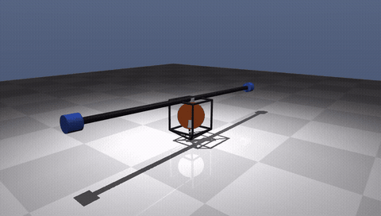
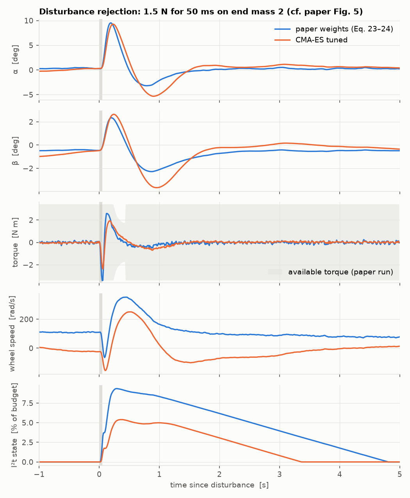
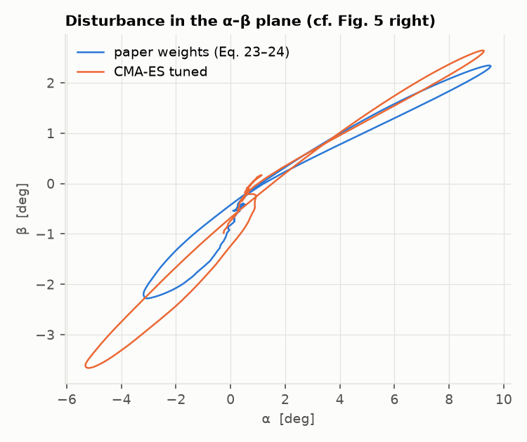
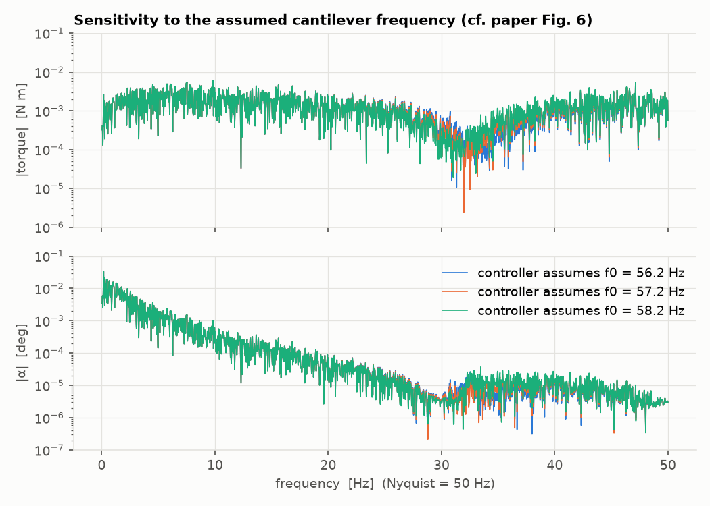

# One-Wheel Cubli in MuJoCo

A simulation replica of

> M. Hofer, M. Muehlebach, R. D'Andrea, **"The One-Wheel Cubli: A 3D inverted pendulum that can balance with a single reaction wheel"**, *Mechatronics* 91 (2023) 102965. [doi:10.1016/j.mechatronics.2023.102965](https://doi.org/10.1016/j.mechatronics.2023.102965) (open access, CC BY 4.0)

It is built in [MuJoCo](https://mujoco.org), with the paper's full estimation and control stack and a tuned controller.



*Tuned controller: it recovers from a 3°/−2° initial tilt, a 1.5 N drop on one end mass (t = 3 s), a 6 N sideways push on the housing (t = 7 s) and a drop on the other end mass (t = 11 s). The full-resolution MP4 is [media/cubli_tuned.mp4](media/cubli_tuned.mp4).*

## What the paper does

The system balances on one corner. It has two tilt degrees of freedom (roll α, pitch β) and only **one** reaction wheel, mounted at 45° between the two tilt axes. It is controllable only because a 1.25 m cantilever with two 0.3 kg end masses makes the pitch inertia much larger than the roll inertia. The resulting time-scale separation (natural-frequency ratio ≈ 1/(1+√2), the inverse *silver ratio*) lets a single torque steer both angles. The controller is a delay-compensating steady-state Kalman filter plus an LQR on a 14-state model that includes the cantilever bending modes.

## What is replicated here

| Paper | This repo |
|---|---|
| 4-body model, generalised coords (α, β, γ, φ, δ₁, δ₂), App. A | `cubli/model.py`. MJCF generated from the Table A.1 parameters. The housing gets three stacked hinges x→y→z, which is exactly the paper's Euler chain. The cantilevers are hinges about body-z at Q, with the identified torsional stiffness k and damping d. |
| Linearised, reduced model, Eq. (11) | `cubli/linearize.py`. Finite-difference linearisation of the MuJoCo model, then the same reduction (drop φ, γ). |
| 5-IMU accelerometer tilt estimate, Eq. (8) | `cubli/controller.py:imu_weights`. MuJoCo accelerometer/gyro sites: 4 in a square near the pivot and 1 far away. |
| Complementary filter, 0.98 / 0.02 (Sec. 5.2) | `Controller.tilt` |
| 1-step-delay-augmented steady-state KF, Eqs. (18)–(21) | `Controller.step` |
| Discrete LQR at Ts = 10 ms, Eqs. (22)–(23); KF tuning, Eq. (24) | `cubli/controller.py:design` |
| CoM-offset estimation by low-pass filtering α, β (Sec. 6) | `Controller.step` |
| Simulation with torque limits, I²t overheat protection, delay, noise (Sec. 7.1) | `cubli/sim.py` |
| Fig. 5 (disturbance rejection), Fig. 6 (beam-frequency sensitivity) | `scripts/make_figures.py` |

### Check 1: the linear model matches Eq. (11)

The MuJoCo model is built only from Table A.1, and its linearisation reproduces the paper's A and B matrices to the printed precision (asserted in `tests/test_replication.py`):

| entry | paper | MuJoCo |
|---|---|---|
| ∂α̈/∂α | 57.7 | 57.7 |
| ∂α̈/∂β | 0.1 | 0.1 |
| ∂β̈/∂β | 10.6 | 10.6 |
| ∂φ̈/∂α, ∂φ̈/∂β | −40.9, −7.5 | −40.8, −7.5 |
| ∂δ̈₁/∂α, ∂δ̈₁/∂δ̇₁, ∂δ̈₁/∂δ̇₂ | −4.2, −19.8, −12.6 | −4.2, −19.8, −12.5 |
| ∂α̈/∂δ̇ᵢ, ∂φ̈/∂δ̇ᵢ | ±4.6, ∓3.2 | ±4.6, ∓3.2 |
| B (α̈, β̈, φ̈, δ̈₁, δ̈₂) | −20.7, −2.3, 1122, 7.4, −7.4 | −20.7, −2.3, 1122.0, 7.4, −7.4 |
| ε = π_β/π_α | 0.43 | 0.428 |

The only mismatch is the β̈ ← δ coupling: the paper prints 75.8, MuJoCo gives 83.3. The paper does not print the other large beam entries (∗).

### Check 2: it balances with the paper's design

With the paper's structure and weights (Eqs. 23–24), the simulated system balances indefinitely. This holds with sensor noise, sensor bias, a 10 ms measurement delay, the torque envelope, I²t derating, and a deliberately injected 2 mm CoM offset. The disturbance response has the same qualitative signature as the paper's Fig. 5. A push in +β first makes the controller command a *negative* torque, which drives α up quickly (the fast axis). A positive torque then brings both angles back together along the level lines of the control law.




The paper says its Fig. 5 disturbance was "approximately the maximum disturbance from which the system can recover". The same holds here. The recoverable drop on an end mass is small (~2 N for 50 ms), because correcting β takes α excursions about 9× larger (B: −20.7 vs −2.3). Those excursions push the wheel toward its no-load speed.

### Where this simulation disagrees with the paper

**Cantilever sensitivity (Fig. 6) is not reproduced.** The paper reports that a ±1 Hz error in the assumed cantilever frequency causes visible structural oscillations. It also reports that ignoring the flexibility altogether destabilises the loop. In this simulation, with the paper's k and d, neither happens:

- The torque and α spectra are almost identical for controllers that assume 56.2, 57.2 or 58.2 Hz.
- A controller designed on a rigid-beam model (k → 10⁸) also balances.



The mechanisms behind the real-hardware effect are not modelled. Plausible candidates are the motor current-loop dynamics, torque ripple, IMU mounting on the flexible structure, anti-aliasing filters, and the 57 Hz mode sitting above the 50 Hz Nyquist frequency. The beam model and the controller's beam states are still fully implemented, so any of those effects can be added.

## Tuning

`scripts/tune.py` runs CMA-ES (40 generations × 40 candidates, warm-started from a shorter first pass) over 20 log-scale multipliers on the paper's weights:

- the 9 LQR state weights plus a shared weight on the delayed states;
- the process- and measurement-noise groups of the KF;
- the complementary-filter weight;
- the CoM-estimator time constant.

The objective (`cubli/evaluate.py:cost`) combines:

- tilt jitter, RMS torque (heating) and mean wheel speed while balancing for 60 s;
- the largest recoverable drop on an end mass and push on the housing (bisection);
- survival and jitter under model errors: beam at 56.2 / 58.2 Hz, end masses +10 %, roll inertia +10 %, a 2-step delay, and 3× sensor noise.

The result is stored in `cubli/tuned_params.json`.

| metric (sim, 3 noise seeds) | paper weights | tuned | change |
|---|---|---|---|
| max recoverable drop on end mass (N, 50 ms) | 2.10 | **2.38** | +13 % |
| max recoverable push on housing top (N, 50 ms) | 8.73 | **10.49** | +20 % |
| tilt jitter α / β (std, deg) | 0.092 / 0.041 | **0.067 / 0.038** | −27 % / −7 % |
| RMS motor torque while balancing (N m) | 0.083 | **0.044** | −47 % |
| mean wheel speed after 30–60 s (rad/s) | 12.1 | **≈0** | |
| survives all 6 model-error scenarios | ✓ | ✓ | |
| torque RMS with 3× sensor noise (N m) | 0.247 | **0.129** | −48 % |

What changed (see `cubli/tuned_params.json` and `cubli/tunings.py`):

- **LQR weights were redistributed, but the net gains barely moved.** The α weight fell 50× and the β weight 2×. The wheel-speed weight rose 2.4× and the weight on the delayed states rose about 140×. The resulting gains are close to the paper's (α: −133 → −146, β: 268 → 294 N m/rad).
- **The Kalman filter trusts the gyro rates much more.** Rate measurement noise went down about 240× and rate process noise up about 20×. This removes estimator lag on α̇ and β̇ and cuts the noise reaching the motor.
- **Much faster CoM-offset estimator** (τ = 20 s → 0.8 s). It acts as an integrator on the balance point, so the wheel speed now averages to zero within seconds. That keeps full torque headroom available for the next disturbance. Ablation: the paper weights with only τ = 0.83 s already reach a 2.27 N drop / 9.4 N push, about half of the total gain. The tuned weights with the old τ = 20 s fall back to 1.73 N / 8.2 N.
- **Complementary filter leans harder on the gyro** (accelerometer weight 0.02 → 0.002).

One trade-off shows in the disturbance plot. The tuned controller uses less peak torque and about half the I²t heating, but it undershoots more on the way back (β reaches about −3.6° instead of −2.2°).

## Assumptions (not given in the paper)

These are flagged with `ASSUMED` in `cubli/params.py`, `cubli/sim.py` and `cubli/controller.py`:

- **Motor envelope.** No-load speed 450 rad/s, stall torque 8 N m, and an I²t budget of about 1 s at peak torque. The paper gives only the 3.4 N m peak and 0.5 N m continuous figures. The no-load speed matters most: it sets the maximum recoverable disturbance.
- **Sensor noise.** MPU-6050-class accelerometer noise 0.04 m/s², gyro noise 0.004 rad/s, residual biases, and Hall-sensor speed noise 0.3 rad/s.
- **IMU positions.** Only the layout (4 near the pivot + 1 far away) is from the paper.
- **State normalisation used before applying Q and R.** The paper normalises but does not give the scales. The printed LQR gain (Eq. 25) is therefore not directly comparable, although its sign pattern (−, −, +, +, +, −, −, +, +) matches.
- **Model additions.** A 2 mm CoM offset toward the motor, and friction at the pivot about the vertical axis: 4·10⁻³ N m dry plus a small viscous term, which is roughly a hard corner on a table.

### Why yaw is not controlled (and can't be, with this wheel)

Like the paper, the controller only stabilises roll and pitch. Yaw is not just left out: the fixed wheel cannot stop a yaw spin at all. About the pivot, gravity and the ground force exert no torque around the vertical, and the motor torque is internal. The total vertical angular momentum is therefore conserved. When the system is balanced, the wheel axis is horizontal, so all of that momentum sits in the body's yaw rotation. In the simulation, a 0.2 rad/s spin is still exactly 0.200 rad/s after 10 s of active balancing.

Gyroscopic coupling does appear once the wheel spins: the yaw ↔ α̇/β̇ terms grow linearly with wheel speed. It can only shuffle momentum around while the body wobbles. Only an external torque stops the spin, which here is the pivot friction. The alternative is a second actuator that can give stored momentum a vertical component: a vertical-axis reaction wheel (as in the original three-wheel Cubli) or a gimbaled wheel (control moment gyroscope). Both of those also saturate and eventually need friction to unload.
- **Wheel inertia.** The paper's wheel inertia includes the motor rotor, so I_wx > I_wy + I_wz, which is not a valid single rigid body. The transverse wheel inertia is raised just enough to be physical. That is a change of about 4·10⁻⁵ kg m² against a housing inertia of about 3·10⁻² kg m², and Check 1 is unaffected.

## Usage

```bash
python -m venv .venv && . .venv/bin/activate
pip install -r requirements.txt

pytest -q                                       # replication checks
python -c "from cubli.sim import run; r = run(T=10); print('fell:', r.fell)"
MUJOCO_GL=egl python scripts/make_figures.py    # figures + results/benchmark.json
MUJOCO_GL=egl python scripts/make_video.py tuned  # or: paper
python scripts/tune.py 40 cubli/tuned_params.json # re-run the CMA-ES tuning (uses 40 cores)
```

Interactive viewer:

```bash
python -c "import mujoco.viewer; from cubli.model import load; m, d = load(); mujoco.viewer.launch(m, d)"
```

### What if the flywheel is offset? (`scripts/wheel_offset.py`)

**Tilting the wheel axis out of the horizontal plane by ζ** gives the motor torque a vertical component, and yaw becomes controllable. Vertical angular momentum is still conserved (L_z = I_z·γ̇ + I_w·sin ζ·ω), so a yaw spin can only be moved *into the wheel*: stopping 0.2 rad/s needs ω ≈ 0.05 / (I_w sin ζ).

One LQR over roll, pitch and yaw at once collapses the balance gains and falls. A cascade works: the paper's balance loop stays as is, and a slow outer loop steers yaw by moving the wheel-speed setpoint (rate-limited, ±300 rad/s). Results with sensor noise and delay, no pivot friction:

| tilt ζ | stop a 0.2 rad/s spin | 30° heading error | max recoverable drop |
|---|---|---|---|
| 0° (paper) | impossible | impossible | 2.37 N |
| 5° | only halves it (needs 628 rad/s of wheel speed) | → 1.9° | 2.77 N |
| 10° | → 0.012 rad/s (wheel 283 rad/s, 315 predicted) | → 1.1° | 2.62 N |
| 15° | falls | → 1.1° | 2.02 N |
| 20° | falls | → 1.0° | 0.82 N |
| 25° | falls | → 0.9° | cannot balance |

So about 10° of tilt buys yaw control without losing balance margin. Beyond about 15°, the roll/pitch authority lost to cos ζ and the gyroscopic coupling at high wheel speed make it fragile. With realistic pivot friction the benefit shrinks. Friction stops spins by itself, but it also destroys the momentum the wheel would need to hand back, so large heading changes run the wheel to its limit.

**An off-centre wheel mass (unbalance)** does nothing useful: the rotating force averages to zero over each turn. It is also nearly harmless here, because the wheel idles near 0 rad/s while balancing. Even 4 mm of offset (0.9 g·m) only lowers the recoverable drop from 2.37 N to 2.06 N, since it only bites during recoveries when the wheel spins at hundreds of rad/s.

Both are adjustable in the live viewer (Plant: wheel tilt, unbalance, pivot friction; plus a yaw-control panel). The viewer's yaw loop is more conservative than the script. Its priorities are balance > stop the spin > heading. It caps the wheel target at 250 rad/s and fades heading correction out as the wheel nears that budget, because the balance loop tracks the wheel-speed target loosely (overshoots of about 150 rad/s) and a looser loop ran the wheel into saturation after about 50 s. At 10° tilt and no friction, it absorbs about 80 % of a 1.5 N sideways tap's spin and never falls in 150 s tests. This frictionless loop has since been replaced in the viewer by the friction-aware controller described next.

### Yaw control on a realistic, frictional pivot (`cubli/yaw.py`, `scripts/yaw_friction.py`)

The frictionless yaw loop above doesn't carry over to a real pivot. With a tilted wheel, three extra things are needed:

1. **Proper wheel-speed tracking.** The balance LQR regulates around a moving wheel-speed reference, plus a feedforward lean and torque that make the wheel accelerate as commanded (`Controller.step(..., wheel_ref=(w_ref, a_ff))`). Two things broke along the way. Removing the LQR's own wheel-speed feedback destabilises balance: its 0.03 N m per rad/s gain looks small but is worth several N m in transients. Feedforward alone lets the wheel drift, because the balance point is never known exactly.
2. **A friction-aware yaw controller** that works in three modes:
   - **turn:** PD on heading on the slow, whole-body timescale (the end masses sit on flexible beams, so a fast jerk only turns the housing: 8× the gain). It adds Coulomb-friction compensation and a breakaway kick.
   - **unload:** each second of turning burns τ_s / (I_w sin ζ) ≈ 25 rad/s of wheel speed at 10°. So once the wheel has used its 150 rad/s turning budget, the controller stops pushing and lets friction stop the body. It then spins the wheel down gently enough (30 % of the stiction torque) that the body stays put and the momentum goes into the ground. Big turns ratchet: turn, unload, turn.
   - **hold:** on target, stiction holds the heading for free, and the gyro bias is re-estimated while the body is known to be still.
3. **A realistic budget.** The balance loop tracks the wheel target loosely (about 150 rad/s of overshoot), so turning stops well short of the 450 rad/s limit. A 220 rad/s budget made 15° tilt fall; 150 rad/s works.

Results on the realistic plant: pivot dry friction 4·10⁻³ N m, 2 mm CoM offset, sensor noise and bias, 10 ms delay.

| tilt | 45° heading command | back to 0° (after 60 s) | 1.5 N sideways tap | 3-min hold drift | max drop |
|---|---|---|---|---|---|
| 10° | ratchets, 14.5° reached after 35 s | 4.8° off | peaks 24.6°, returns to 3.8°, wheel unloaded to 1 rad/s | −1.0° | 2.72 N |
| 15° | 32° reached after 35 s | 3.5° off | peaks 18.5°, returns to 3.6°, wheel 1 rad/s | −0.15° | 2.86 N |

Robustness: no falls in 24 runs with pivot friction at 0.5×, 1× and 2× the controller's assumption, at 10° and 15° tilt, over two noise seeds. The peak wheel speed stayed at or below 304 rad/s. The remaining heading error of about 3–10° is a sensing limit: heading is the integrated gyro, and errors picked up while turning (including slow creep during unloading) stay. An absolute heading sensor (magnetometer, camera) would remove it. Turns are slow, and slower still with more friction. That's the price of pushing a 1.25 m bar around against a sticky pivot with 0.08–0.12 of the wheel's torque.

### What if the two end masses become a ring? (`scripts/ring_design.py`)

The idea: replace the cantilever and end masses with a hoop in the pitch plane, so it looks like a ring balancing with the flywheel inside. I kept the paper's parameters as far as physically possible. The hoop is modelled as rigid, and the carbon tube's mass is removed from the housing.

**It can't keep the parameters, for a geometric reason.** The paper's added mass is wide and low: end masses 0.6 m out and only 0.21 m up. That makes pitch inertia about 5× roll inertia (ε = 0.43, the silver ratio). A circle standing on its bottom is as tall as it is wide:

- a uniform hoop adds MR² about pitch but 1.5·MR² about roll (both about its bottom point), capping the ratio at 4/3;
- even with all its mass at 3 and 9 o'clock the cap is 2.

| | bar (paper) | A: hoop, housing in middle | B: hoop through pivot | C: Ø0.4 m hoop through pivot + 2×0.3 kg at 3/9 o'clock |
|---|---|---|---|---|
| what's kept | – | total mass, pitch inertia | pitch inertia, gravity torque | – |
| size | 1.25 m bar | R 0.32 m, 0.74 kg | R 0.84 m, 0.18 kg | R 0.2 m, 0.1 kg hoop + weights |
| ε = π_β/π_α | 0.43 | 0.91 | 0.87 | 0.78 |
| controllability volume (Eq. 4) | 0.39 | 0.0004 | 0.0011 | 0.038 |
| balances | yes | **no**: needs gains around 5,500 N m/rad, saturates the motor within 0.2 s even with perfect sensors | **no** | yes, but fragile |
| recoverable initial tilt | > 2° | – | – | about 1° |
| max drop on the far end (50 ms) | 2.34 N | – | – | 0.63 N |
| wheel speed while undisturbed | ~0 | – | – | 190–230 rad/s |

With nearly equal tilt frequencies, the single wheel can barely tell the two directions apart. The LQR gains explode and the 3.4 N m / 450 rad/s motor saturates. Getting a ring-like shape to work well needs the mass wide and low again:

- a flattened (elliptical) hoop;
- a hoop balanced on a post at its centre, so the ring's height no longer counts;
- or a much stronger actuator.

All three layouts can be picked in the live viewer (Plant → Layout).

**Bigger motor for hoop A?** (`scripts/ring_bigmotor.py`) I scaled the motor ×2–10 (torque, and its mass: +0.36 kg per ×1) and the flywheel ×1–8 (inertia and mass), re-searching 81 LQR weightings per size. **Nothing balanced.** Taking the problem apart:

| actuator | sensors | result |
|---|---|---|
| unlimited torque and speed, no added mass | perfect | recovers from ≤ 0.3° (needs 30 N m peaks and 9° swings). From 1°, it swings to 24° and falls even with 99 N m |
| unlimited, no added mass | MPU-6050 class (as the paper) | falls (2/3 seeds; 3/3 with the 2 mm CoM offset) |
| unlimited, no added mass | 10–100× better | balances |
| real ×10 motor + ×10 flywheel (+5.5 kg at the hoop centre) | 10–100× better | falls: the added central mass pushes ε even closer to 1 |
| massless 7–34 N m motor with 2000 rad/s no-load speed | 10× better | balances on some seeds only, wheel at 760–1000 rad/s |

The hoop's tilt frequencies are nearly equal (ε = 0.91), so correcting a small error in the weakly controllable direction takes seconds of large, coordinated swings (25–65× the error). That makes the hoop hypersensitive to sensor error, and a heavier actuator at the centre makes ε worse. A bigger motor is not the fix. The fix is restoring the inertia asymmetry (flattened hoop, or a hoop on a post).

## Live interactive viewer

`app/server.py` runs the real MuJoCo plant and the full estimator/controller in real time, and streams it to your browser:

- a live 3D view: drag to orbit, scroll to zoom, **shift+drag (or Grab mode) to pull on any part** with a spring force;
- disturbance buttons and keys (drops on the end masses, pushes on the housing) with adjustable force and duration;
- live charts of tilt, motor torque against the available-torque envelope, wheel speed and I²t heating;
- live switching between paper and tuned weights, CoM estimator on/off, sensor-noise level and measurement delay;
- plant changes (end mass, beam frequency, CoM offset), applied as a model-mismatch test;
- a "Runs & progress" panel that launches CMA-ES tuning, the benchmark or the tests and streams their progress, including a cost-per-generation chart.

```bash
MUJOCO_GL=egl python app/server.py      # serves http://127.0.0.1:8765
# on a remote machine, forward the port from your laptop first:
ssh -L 8765:localhost:8765 <user>@<host>
```

Keys: `Q`/`E` drop on the left/right mass, arrows push the housing, `T` taps an end mass sideways, `Space` pauses, `R` resets. The server listens on localhost only.

## Layout

```
cubli/params.py      Table A.1 parameters (+ flagged assumptions)
cubli/model.py       MJCF generator
cubli/linearize.py   linearisation / reduction / ZOH discretisation
cubli/controller.py  IMU fusion, complementary filter, delay-KF, LQR, CoM estimator
cubli/sim.py         closed loop: plant, sensors, delay, motor envelope + I²t
cubli/evaluate.py    benchmark scenarios, metrics, tuning objective
cubli/tunings.py     "paper" and "tuned" controller settings
cubli/live.py        step-wise interactive simulation for the viewer
app/                 live web viewer (aiohttp server + single-page UI)
scripts/             tuning, figures, video
tests/               replication checks
```

## Credit

The system design, model, parameters, and estimation/control architecture are from Hofer, Muehlebach and D'Andrea (2023), ETH Zürich, licensed CC BY 4.0. This repository is an independent simulation re-implementation and is not affiliated with the authors.
